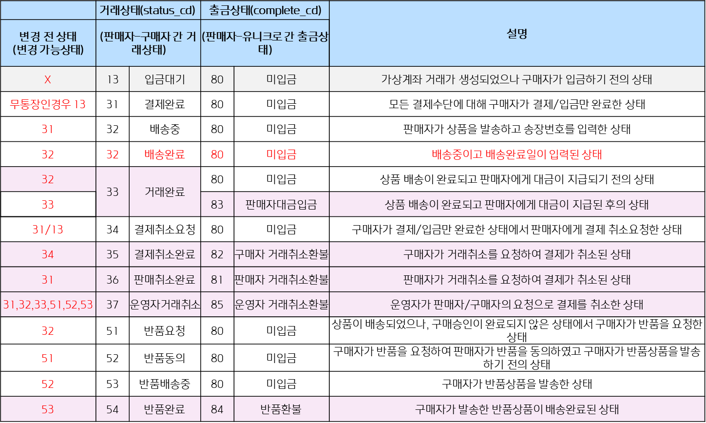

# 유니크로 제휴사 서비스 정책

## 수수료 정책

#### 유니크로 수수료

유니크로 수수료는 결제수수료와 안전거래수수료를 합한 금액입니다.\
모든 수수료는 부가세(VAT)포함 수수료입니다.\
결제금액에서 유니크로 수수료가 공제된 후 판매대금이 판매자의 계좌로 지급됩니다.\
유니크로는 반품 / 취소 수수료가 없습니다.

**<결제수수료>**

| 결제수단        | 결제수수료                             |
| ----------- | --------------------------------- |
| 신용카드        | 3.7%                              |
| 실시간 계좌이체    | 300원(10,000원 이하) / 2%(10,000원 이상) |
| 무통장입금(가상계좌) | 2% (최저 500원)                      |

**<안전거래수수료>**

| 금액    | 일반안전거래     | 프리미엄안전거래   |
| ----- | ---------- | ---------- |
| 100만원 | 1,000원/건   | 2,000원/건   |
| 100만원 | 상품가격의 0.5% | 상품가격의 0.7% |

***

## **한도정책**

#### 제휴사 거래한도

거래한도는 일(매일 0시 초기화)/월(매월1일 초기화) 기준이 존재합니다.\
결제수단별 한도가 지정되어 있으며,\
현재까지의 결제금액이 한도를 초과할 경우 일/월 기준이 초과한 후에 결제가 가능합니다.\

**<구매자 거래한도> : 제한없음**&#x20;

**<판매자 거래한도> : 거래한도 총 일 3,000만원 / 월 3,000만**

| 신용카드                              | 실시간 계좌이체                         | 무통장입금                            |
| --------------------------------- | -------------------------------- | -------------------------------- |
| 
일 1,000만원

월 1,000만원 
 | 
일 1,000만원

월 1,000만원
 | 
일 1,000만원

월 1,000만원
 |

## **상품금액제한**

상품등록 시 상품을 지할 수 있는 금액 제한이 존재합니다.

**상품금액(결제금액) 기준**

| 신용카드   | 실시간 계좌이체 | 무통장입금  |
| ------ | -------- | ------ |
| 400만원  | 100만원    | 5,000만 |

## 정산주기

* 정상거래 (판매자) : 배송완료 후 D+3
*   **정산지급**

    | 구분               | 일반안전거래     | 프리미엄안전거래   |
    | ---------------- | ---------- | ---------- |
    | 결제일로부터 D+3영업일 이내 | 결제일로부터 D+3 | 결제일로부터 D+2 |
    | 결제일로부터 D+3영업일이후  | 구매승인일 D+1  | 구매승인 당일    |

    **<결제수단별 최소 대금지급 기간>**

    | 신용카드            | 실시간 계좌이체        | 무통장입금                                                   |
    | --------------- | --------------- | ------------------------------------------------------- |
    | 결제+48H (D+3영업일) | 결제+48H (D+3영업일) | 
100만원 미만 : 결제+24H(D+2) 100만원 이상 : 결제+48H(D+3)
 |
* 환불거래 (구매자) : 반품완료 후 D+1

## 유니크로 거래 프로세스

<figure><figcaption>
유니크로 거래 프로세스
</figcaption></figure>

## 거래 및 출금상태표

<figure><figcaption>
거래상태 및 출금상태표 (붉은색 음영 거래종료로 상태변경 불가)
</figcaption></figure>

## 거래상태 변경에 따른 알림톡 발송리스트

| 템플릿명                           | 발송시점                        | 액션주체      | 발송대상 |
| ------------------------------ | --------------------------- | --------- | ---- |
| \[구매자] 입금계좌 안내                 | 입금대기(13) 생성                 | 구매자       | 구매자  |
| \[구매자] 입금종료 안내                 | 입금대기(13) 에서 5시간 경과          | batch     | 구매자  |
| \[판매자] 상품 발송 요청                | 결제완료(31) 생성                 | 구매자       | 판매자  |
| \[재] \[구매자] 상품 발송 안내           | 결제완료(31) -> 배송중(32) 변경      | 판매자       | 구매자  |
| \[재] \[판매자] 구매승인 완료            | 배송중(32) -> 거래완료(33) 변경      | 구매자/batch | 판매자  |
| \[판매자] 반품동의 요청                 | 배송중(32) -> 반품요청(51) 변경      | 구매자       | 판매자  |
| \[구매자] 반품 발송요청                 | 반품요청(51) -> 반품동의(52) 변경     | 판매자       | 구매자  |
| \[재] \[판매자] 반품배송 시작            | 반품동의(52) -> 반품배송중(53)       | 구매자       | 판매자  |
| \[구매자] 반품완료 안내                 | 반품배송중(53) -> 반품완료(54) 변경    | 판매자       | 구매자  |
| \[판매자] 결제취소 요청                 | 결제완료(31) -> 결제취소요청(34) 변경   | 구매자       | 판매자  |
| \[구매자] 결제취소 동의                 | 결제취소요청(34) -> 결제취소완료(35) 변경 | 판매자       | 구매자  |
| \[구매자] 판매취소 안내                 | 결제완료(31) -> 판매취소완료(36) 변경   | 판매자       | 구매자  |
| \[판매자] 배송정보 수정 요청              | 어드민 거래홀드 처리                 | 관리자       | 판매자  |
| \[재] \[구매자] 구매승인 안내            | 자동구매승인 1영업일 전               | batch     | 구매자  |
| 구매자\_일반결제\_구매승인 요청\_2021       | 자동구매승인 3영업일 전               | batch     | 구매자  |
| 구매자\_일반결제\_구매승인 요청(배송완료)\_2021 | 배송완료값 수신 당일                 | batch     | 구매자  |

* 거래 상태 변경시 발송되는 알림톡은 기본 유니크로 양식이 존재합니다.
* 제휴사 별 별도 양식이 필요하신 경우 당사와 협의가 필요합니다.
* 거래별 문의사항 연동
* 제휴사 거래 조회를 위한 관리자 세부 조율
